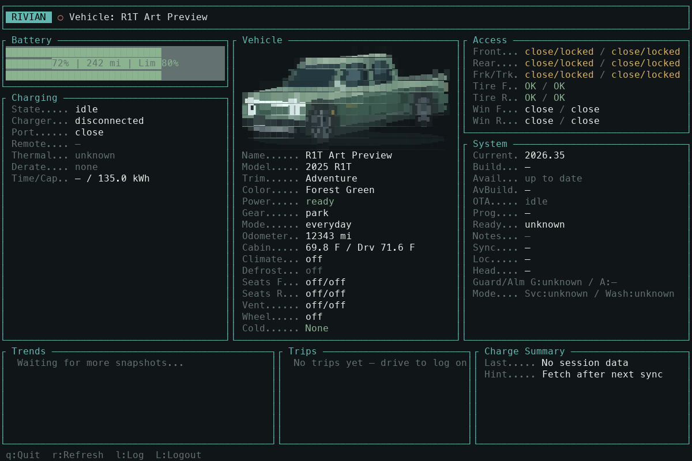

# R1T terminal illustration

The dashboard uses an original Forest Green R1T drawing in a front three-quarter view. The short open bed, crew cab, gear tunnel, large wheel arches, and hollow stadium headlights give the pickup its shape. Rivian’s [R1T configurator imagery](https://rivian.com/configurations/builder?MODEL=R1T) was the proportion reference; no photograph or downloaded asset is bundled.



[Compare the artwork at several terminal sizes](images/r1t-art.png).

## Preview without an account

From this worktree:

```sh
cargo run --example r1t_art
```

Resize the terminal to compare sizes. At 128 columns and 36 rows or larger, the preview includes three compact versions. Press `q` or Escape to close. This example does not access credentials, a database, or the vehicle API.

For repeatable visual review, export the actual ratatui character cells and RGB colors:

```sh
cargo run --example r1t_art -- --export /tmp/r1t-art.json --width 132 --height 40
```

## Rendering and layout

- Uses standard Unicode block elements and 24-bit terminal color, with no image protocol or additional dependencies.
- Fits from 32 × 8 to 76 × 18 terminal cells, preserving the drawing’s proportions. A typical 120 × 40 dashboard has room for a 38 × 9 illustration with all vehicle rows visible.
- Uses the space left after the vehicle information. Short or narrow panels omit the illustration. Known models other than R1T also omit it.
- Draws the geometry and fits glyphs only when the illustration size changes. Normal dashboard redraws copy cached cells.

The editable geometry and palette are in `src/vehicle_art.rs`. Each drawing group is labeled. Headlight outlines are deliberately exaggerated and weighted during glyph selection so they remain bright at small sizes. The dashboard integration is in `draw_col_vehicle` in `src/tui.rs`.

The image above is a rendering of ratatui’s test buffer in Menlo; exact glyph edges vary with terminal font and line spacing. The interactive example is the best way to inspect your terminal’s result.
